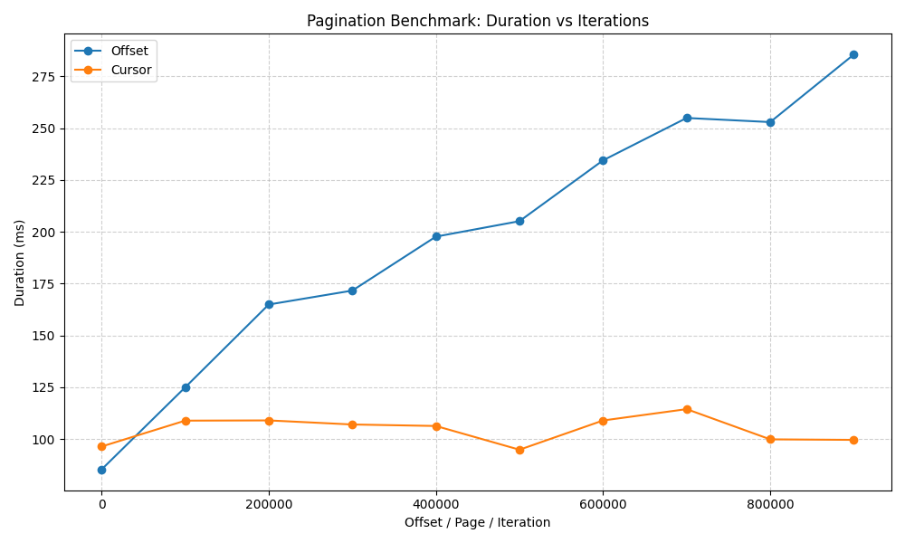

# Pagination Benchmarks with FastAPI & Postgres

This project explores different pagination strategies (**Offset, Page, Cursor**) in a PostgreSQL database using **FastAPI**.
It includes implementations of each pagination style, a dataset population script, and benchmarking with plots + console summaries.

---

## 🚀 Getting Started

### 1. Install dependencies

```bash
uv sync
```

### 2. Populate .env
Taking reference from [`.env.example`](.env.example) file make your own `.env` file.

### 3. Start FastAPI server

```bash
uv run fastapi dev api/main.py
```

This will start the server at [http://localhost:8000](http://localhost:8000).

---

## 🗄️ Setup Database

Before running benchmarks, populate the database with test data:

```bash
uv run python populate.py
```

This creates and fills the `pagination_dataset` table with ~1M rows (configurable in the script).

---

## 📊 Running Benchmarks

Run the benchmarking script to compare pagination strategies:

```bash
uv run python benchmark.py
```

This will:

* Execute multiple paginated queries (Offset, Cursor).
* Print results in a **rich table** (console).
* Generate a **plot** (`pagination_benchmark.png`) showing query times.


And a plot like:



---

## 📌 Project Structure

```
.
├── api
│   ├── db.py              # Database connection
│   ├── main.py            # FastAPI app with pagination endpoints
│   └── __pycache__        # Compiled files
├── benchmark.py           # Benchmark script (Rich + matplotlib)
├── pagination_benchmark.png # Benchmark results (generated)
├── populate.py            # Script to populate Postgres with test data
├── pyproject.toml         # Project dependencies
├── README.md              # Documentation
└── uv.lock                # Dependency lockfile
```

---

## 📝 Notes

* The dataset size and benchmark parameters can be tuned in `populate.py` and `benchmark.py`.
* Benchmarks were run on **1M rows** in Postgres.
* For large datasets, **Cursor/Keyset pagination** is significantly more efficient than Offset/Page.

---
